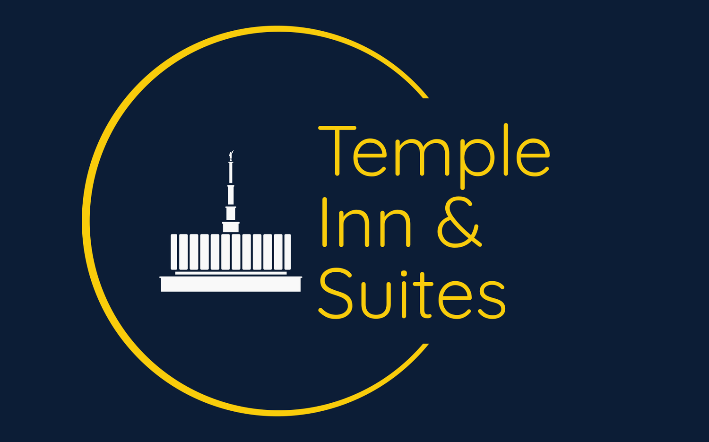
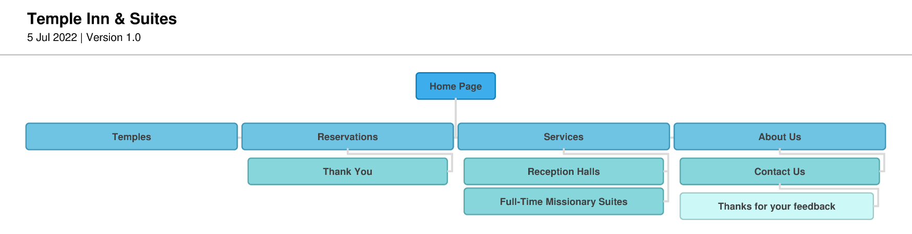

# Temple Inn & Suites Website Plan

## Site Purpose
The Temple Inn & Suites is a hotel chain headquartered in Bethesda, MD that builds and manages specialized hotel accommodations near temple locations of The Church of Jesus Christ of Latter-day Saints around the world. The owner-operated company caters to temple workers, patrons, and their families by providing specialized services and accommodations that meet the needs of those patrons. The hotel accommodations and services are available to anyone willing to abide by the terms and policies outlined by the company. __The overall goal of the website project is to promote and provide information about the specialized services that this hotel chain offers to meet the needs of temple patrons who come to serve in the temple or who participate in events such as sealings, weddings, receptions, and youth trips.__ The website should reflect the Church culture and be designed to support a temple oriented theme as well as the concept of being a haven of comfort and accessibility.
## Target Audience and Scenarios
This site is meant to help those who are travelling long distance to visit a Church of Jesus Christ of Latter-day Saints temple, or are working at a temple for an extended period of time as a temple worker. 
We also provide other services such as wedding reception venues which may be of use to members of the LDS faith. 
## Site Map

### Page Plan
| Page                            | Feature                                                                                                                                     |
|---------------------------------|---------------------------------------------------------------------------------------------------------------------------------------------|
| Home                            |                                                                                                                                             |
|                                 | A call to action to make a reservation                                                                                                      |
|                                 | Available navigation and contact information                                                                                                |
|                                 | Summary information about the temple of your choosing                                                                                       |
|                                 | Social media links (at least two)                                                                                                           |
|                                 | Current weather card with conditions                                                                                                        |
|                                 | - Current temp, conditions, & humidity                                                                                                      |
|                                 | - Closable Weather Alert at top of page                                                                                                     |
|                                 | - 3-day of the "day" temp for next three days                                                                                               |
| Temples                         |                                                                                                                                             |
|                                 | Describes the details of at least 4 temples of your choice                                                                                  |
|                                 | Get information from https://www.churchofjesuschrist.org/temples/list?lang=eng                                                              |
|                                 | - Address, phone, email, services, history, ordinance schedule, session schedule, temple closure schedule                                   |
|                                 | - Store all this in JSON file                                                                                                               |
|                                 | - Display each as a card layout (consider having additional info available by clicking on the card)                                         |
|                                 | - Provide a "LIKE" button and include that information in localStorage; This should be persistent everytime they visit                      |
| Reservations                    |                                                                                                                                             |
|                                 | Contains a form that collects pertinent data for making a reservation:                                                                      |
|                                 | - Location                                                                                                                                  |
|                                 | - Date of stay                                                                                                                              | 
|                                 | - Number and type of rooms                                                                                                                  | 
|                                 | - Registrant's Full Name                                                                                                                    |
|                                 | - Email                                                                                                                                     |
|                                 | - Phone                                                                                                                                     | 
|                                 | - Home State/Country                                                                                                                        |
|                                 | - Special Accommodations/Comments                                                                                                           | 
|                                 | ** Include form validation                                                                                                                  |
| Services                        |                                                                                                                                             |
|                                 | Provide a list of the amenities and the services available at this location                                                                 | 
|                                 | Include subpages for:                                                                                                                       |
|                                 | - Receptions - displaying information for wedding reception accommodations, including options for food service and setup                    |
|                                 | - A full-time missionary page - provides information and images about suites offered at the hotel with a simple Contact Us form for details |
| Each Page must include a footer |                                                                                                                                             | 
|                                 | Containing:                                                                                                                                 |
|                                 | - Full Contact Information (Company Address: 4800 Montgomery Ln #300, Bethesda, MD 20814)                                                   |
|                                 | - Link to Google Map showing Company Address                                                                                                | 
|                                 | - Social media links (again)                                                                                                                |
|                                 | - A basic Contact Us form                                                                                                                   |
|                                 | - Any other relevant materials                                                                                                              |

## Color Scheme

## Typography

## Wireframe Sketches